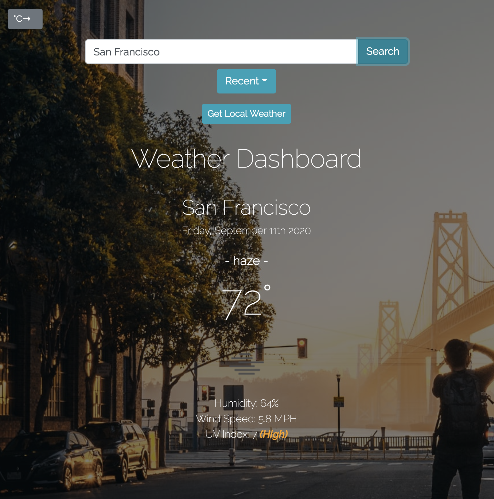
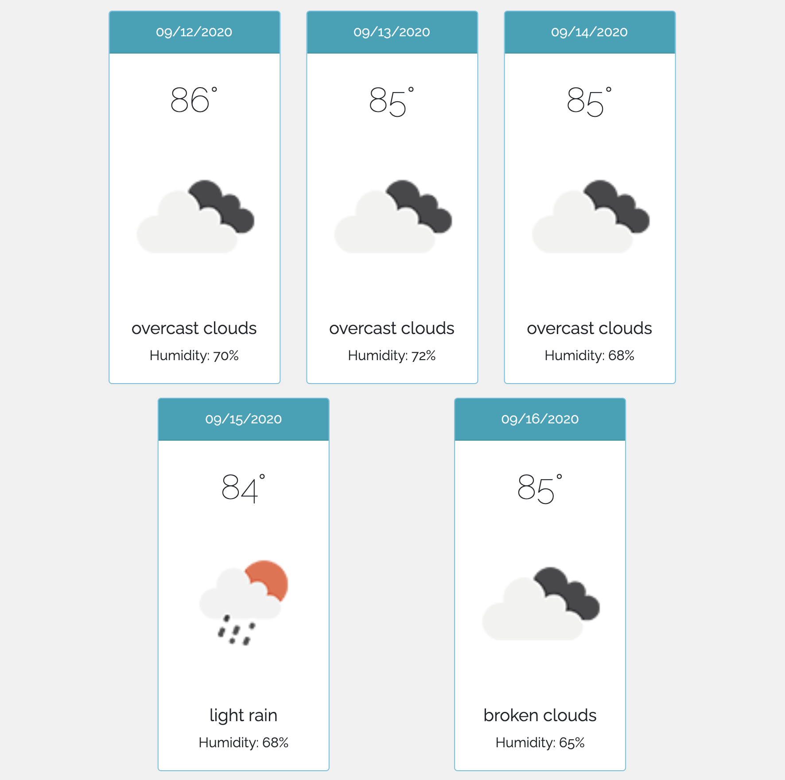

# Weather Dashboard

### Deployed Application 

[Weather Dashboard](https://mhans003.github.io/weatherapp/)

### Description 

This program is a weather application that allows the user to retrieve the current weather and 5-day forecast for a city. 

When the program initiates, any previous searches stored in the browser's local storage will be available for the user in a dropdown menu. The user may choose to retrieve the local weather (once the local coordinates have been received and processed using the window navigator object) or search for a city globally. Results are accessed from Openweathermap.org and displayed dynamically for the user. A banner alert will appear for the user if a search does not retrieve a result. 

The user may switch between fahrenheit and celsius depending on preference at any time, and the 5-day forecast for the selected city will appear at the bottom of the page when a city's current weather is searched for and retrieved. 

### Features

* Openweathermap API is used to retrieve live weather data, forecast, and UV data to display to the user. 
* Responsive to screen sizes across devices. 
* Incorporates Bootstrap utilities including container, buttons, alerts, dropdown, and forms. 
* Bootstrap Toggle feature is included to allow the user to switch between fahrenheit and celsius at any time, which converts the units live on the screen. 
* Recent searches appear for the user for easy access in a dropdown menu. The most recent search appears at the top of the list. 
* Demonstrates the use of the browser's local storage utilizing localStorage and JSON methods. 
* Keywords from the user's search and retrieved weather data is used to access random images from Unsplash, changing the background image for the user on each use. 
* Dynamically-produced elements allow for a cleaner HTML homepage. 

